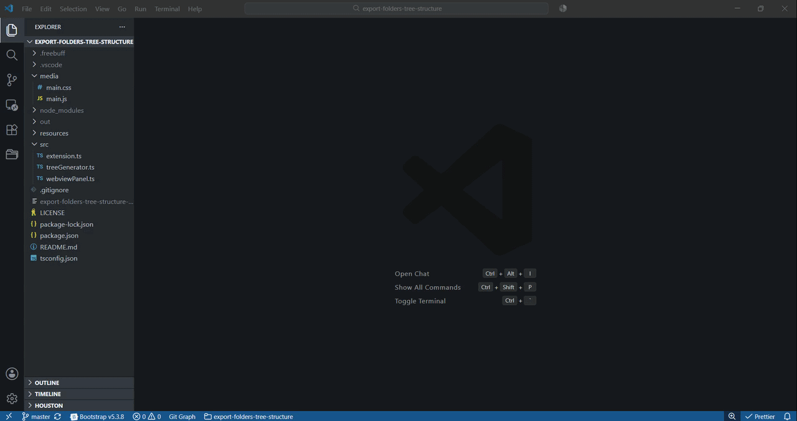

# Export Folders Tree Structure

An extension that generates the **tree structure of any folder** in your workspace, with configurable ignore patterns, one-click copy, and `.txt` / `.md` export.




## ✨ Features

- 🌲 **Tree view generator** — ASCII tree of any folder in your workspace, similar to the `tree` CLI.
- 🚫 **Ignore patterns** — built-in defaults (`.git`, `node_modules`, `dist`, ...) plus a fully customizable pattern list.
- 📋 **Copy to clipboard** — instantly copy the rendered tree.
- 💾 **Export to file** — save the tree as `.txt` or a markdown-fenced `.md`.
- 🧠 **Smart defaults** — intelligent ·* glob matching, max depth safety, hidden-file inclusion, optional file sizes.
- ⚡ **Right-click integration** — context-menu entries on folders: `Show`, `Copy`, `Export`.

## 📦 Installation>
1. Clone or download this repository.
2. Run `npm install`.
3. Open the folder in VS Code and press `F5` to launch an Extension Development Host with the extension loaded.
4. For a packaged `.vsix`, use `vsce package` (requires `npm i -g @vscode/vsce`).

## 🚀 Usage

### From the Explorer
Right-click any folder → **Folder Tree** → choose **Show**, **Copy**, or **Export**.

### From the Command Palette
- `Folder Tree: Export: Show Folder Tree Structure` — opens the tree in a side panel.
- `Folder Tree: Export: Copy Folder Tree to Clipboard`
- `Folder Tree: Export: Save Folder Tree as text`

### The side panel
- **Refresh** — refresh the current folder.
- **Copy** — sends the rendered tree to the clipboard.
- **Export text** — opens a save dialog for rendered tree as .txt/.md.
- **Options** — Hidden files, Show size from the panel; the choices are persisted to workspace `settings.json`.
- **Ignore pattern input** — add custom ignore patterns (e.g., `*.lock`, `src/**/*.test.ts`, `coverage`, `**/node_modules`). They appear as removable chips. Default patterns are tagged as “default” and can be removed from Settings if needed.

If a folder is deeper than `maxDepth`, the truncated subtree is replaced with a `… (truncated)` marker so it's visually obvious you didn't see everything. Malformed glob patterns are reported back as a feedback line and skipped.

## ⚙️ Configuration

| Setting | Description | Default |
| --- | --- | --- |
| `exportFoldersTreeStructure.defaultIgnorePatterns` | Patterns always ignored (glob). Edit in `settings.json`. | `["​.git", "node_modules", "​.vscode", "dist", "build", "out", "​.next", "​.cache", "​.DS_Store", "*.log"]` |
| `exportFoldersTreeStructure.customIgnorePatterns` | User-added patterns (managed from the panel). | `[]` |
| `exportFoldersTreeStructure.includeHidden` | Include dotfiles / dotfolders. | `true` |
| `exportFoldersTreeStructure.maxDepth` | Maximum recursion depth (1–100). | `20` |
| `exportFoldersTreeStructure.showFileSize` | Append file sizes to each entry. | `false` |
| `exportFoldersTreeStructure.searchHighlightColor` | Background color for search match highlights in the tree. Set via the color picker in Settings UI. | `#FFDC0059` |

Patterns support globs: `*`, `**`, `?`, and character classes. Match semantics:

- `*.log` — every `.log` file anywhere
- `src/**/*.spec.ts` — every spec under `src/`, no matter how deeply nested
- `**/node_modules` — any `node_modules` folder at any depth (also matches the basename `node_modules`)
- `coverage` — the `coverage` folder or file at the top level
- `src/**/foo.ts` also matches `src/foo.ts` — `**/` represents zero or more directory segments.

## 🛠️ Development

```bash
npm install
npm run watch    # incremental build
# in VS Code: F5 (Run Extension)
```

Build output goes to `./out/`. The webview's HTML / CSS / JS live in `./media/`.

## 📁 Project structure

```
.
├── package.json
├── tsconfig.json
├── src/
│   ├── extension.ts        # entry point, commands
│   ├── webviewPanel.ts     # webview host & message routing
│   └── treeGenerator.ts    # tree walker, ignore-pattern matching, ASCII renderer
├── media/
│   ├── main.css
│   └── main.js
└── README.md
```

## 📝 License

MIT.
